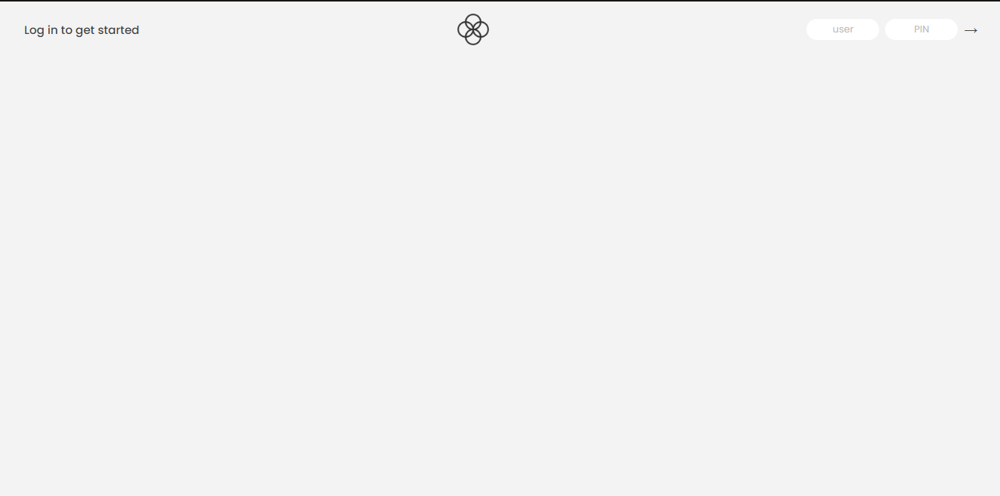
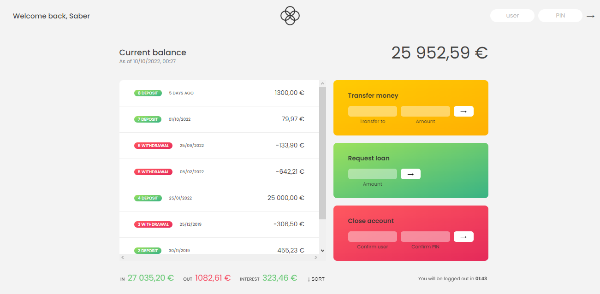

# 💸 Banking_JS_App

Bankist is a fictitious and minimalistic online banking application that allows the user to:

- Log in with a username and password
- View and sort their monetary movements
- Transfer money to another account
- Request a loan from the bank
- Delete their account

Log in credentials:
- username: md | password: 1111
- username: jd | password 2222

Bugs/problems that still need to be fixed:
- Responsive Design

## Deployment

Deployed Website: https://bankkkk.netlify.app

## Built With

  * HTML
  * CSS
  * JavaScript

Readme file by: Jennifer Rosa

## Acknowledgments

  * The Complete JavaScript Course 2021: From Zero to Expert! by @Jonas_Schmedtmann
